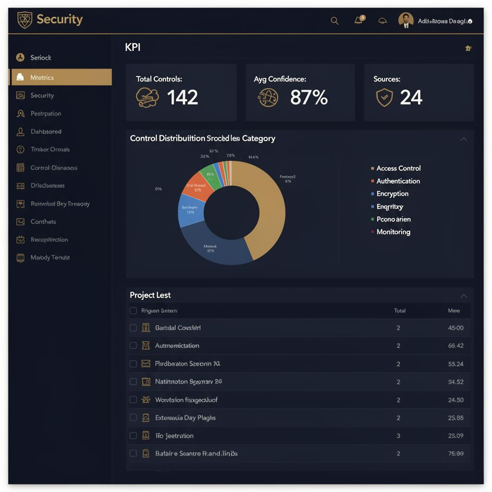
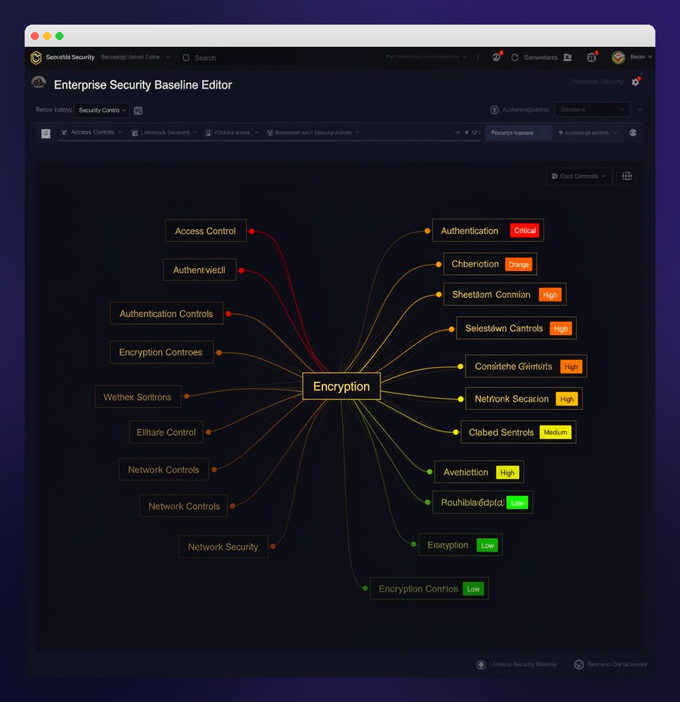
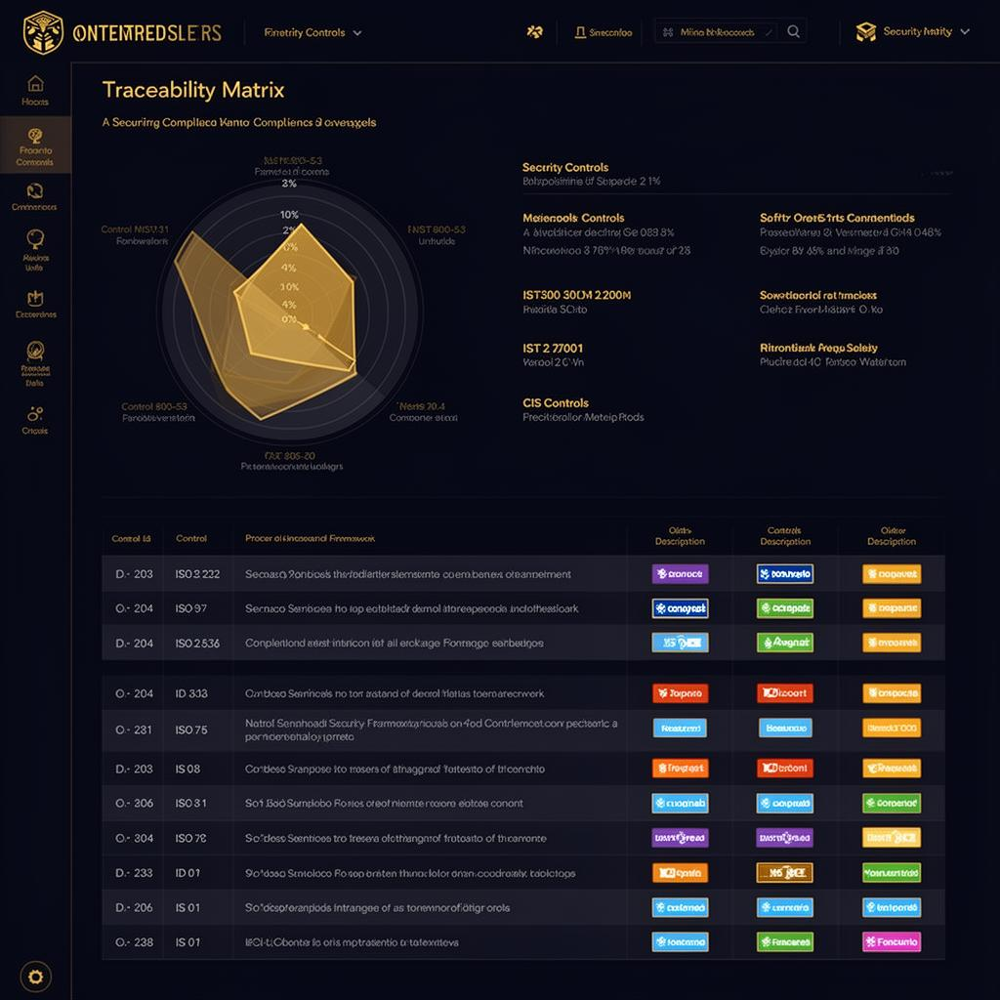

<p align="center">
  
</p>

<h1 align="center">🛡️ Aureum Baseline Studio</h1>

<p align="center">
  <strong>AI-Powered Security Baseline Generation & Compliance Management</strong>
</p>

<p align="center">
  <a href="#-features">Features</a> •
  <a href="#-quick-start">Quick Start</a> •
  <a href="#-test-credentials">Test Credentials</a> •
  <a href="#-screenshots">Screenshots</a> •
  <a href="#-architecture">Architecture</a> •
  <a href="#-tech-stack">Tech Stack</a>
</p>

---

## 🎯 What is Aureum?

Aureum Baseline Studio is an enterprise-grade platform for **automated security baseline generation**. It uses AI to analyze technical documentation, vendor guides, and security standards to generate comprehensive security controls — then maps them to compliance frameworks like **NIST 800-53**, **ISO 27001**, and **CIS Controls**.

### Who is it for?

- **Security Engineers** — Automate the creation of security baselines from vendor documentation
- **Compliance Officers** — Map controls to regulatory frameworks with full traceability
- **CISOs & Security Managers** — Get visibility into security posture with dashboards and reports
- **GRC Teams** — Streamline governance, risk, and compliance workflows

---

## 🔐 Test Credentials

> Use these credentials to explore the full platform:

| Field    | Value                |
|----------|----------------------|
| **Email**    | `test@aureum.com`    |
| **Password** | `test1234`           |

You can also sign up with Google OAuth or create a new account.

---

## 🚀 Quick Start

### 1. Login

Navigate to the application and sign in using the test credentials above, or create your own account.

### 2. Create a Project

Go to **New Project** in the sidebar and fill in:
- **Project Name** — e.g., "AWS EC2 Security Baseline"
- **Technology** — e.g., "AWS EC2"
- **Vendor** — e.g., "Amazon Web Services"

### 3. Add Sources

Navigate to **Source Library** and add your documentation:
- 📄 **Upload files** — PDF, DOCX, TXT, Markdown, HTML
- 🔗 **Import from URL** — Paste a documentation URL and the AI will extract content
- 🏷️ **Tag sources** — Organize with custom tags for better traceability

### 4. Generate Controls with AI

Go to **AI Workspace** and click **Generate Controls**:
- The AI analyzes all your sources
- Generates security controls with descriptions, criticality levels, and threat scenarios
- Each control gets a **confidence score** (0-100%)

### 5. Review & Edit

Open the **Baseline Editor** to review generated controls:
- ✅ Approve, ✏️ Edit, or ❌ Reject each control
- Use the **Mind Map** view for a visual overview
- Filter by category, criticality, or review status

### 6. Map to Frameworks

Use **Traceability** to map controls to compliance frameworks:
- View coverage with the **Radar Chart**
- Identify gaps in your framework compliance
- Export the **Traceability Matrix** as CSV

### 7. Export Your Baseline

Go to **Export / Import** to download your baseline:
- 📊 CSV export for spreadsheets
- 📋 JSON export for integrations
- 📄 PDF report for stakeholders

---

## ✨ Features

### 📊 Dashboard
Centralized overview with KPI cards, project metrics, and quick actions.



**Key metrics at a glance:**
- Total controls generated across all projects
- Average confidence score
- Source count and processing status
- Control distribution by category (donut chart)

---

### 🗺️ Baseline Editor & Mind Map

Visual mind map showing controls organized by category with color-coded criticality levels.



**Features:**
- **Table View** — Traditional list with inline editing
- **Mind Map View** — Interactive visualization with zoom, pan, and collapse
- **Filters** — By category (Access Control, Authentication, Encryption, etc.), criticality (Critical, High, Medium, Low), and review status
- **Bulk Actions** — Approve or reject multiple controls at once
- **STRIDE Filter** — Filter by threat model categories

---

### 📈 Traceability Matrix

Map your security controls to industry compliance frameworks.



**Supported Frameworks:**
- 🏛️ **NIST 800-53** — Federal security controls
- 🌐 **ISO 27001** — International information security
- 🔒 **CIS Controls** — Center for Internet Security benchmarks
- 📋 **NIST CSF** — Cybersecurity Framework
- 🏢 **SOC 2** — Service Organization Controls
- 🔐 **PCI DSS** — Payment Card Industry standards

**Visualization:**
- **Radar Chart** — See coverage percentage per framework
- **Matrix Table** — Detailed control-to-framework mapping
- **Gap Analysis** — Identify unmapped controls

---

### 🤖 AI Assistant

Context-aware AI assistant available on every page.


**Capabilities:**
- 💬 Ask questions about the platform in any language (EN, PT, ES)
- 🎯 **Contextual suggestions** — Quick questions adapt to the page you're on
- 📖 Deep knowledge of security frameworks, controls, and best practices
- ⚡ Real-time streaming responses with Markdown rendering
- 🗑️ Clear chat and start fresh anytime

---

### 📄 Source Library

Upload and manage documentation that feeds the AI pipeline.

**Supported formats:** PDF, DOCX, TXT, MD, HTML  
**Import methods:** File upload, URL import  
**Processing pipeline:** Pending → Extracting → Normalized → Processed

---

### 📜 Version History

Full version control for your security baselines.

- **Version snapshots** — Every change creates a new version
- **Compare versions** — Side-by-side diff view
- **Restore** — Roll back to any previous version
- **Change summaries** — See what changed between versions

---

### 🤖 AI Integrations

Configure multiple AI providers or use the built-in Lovable AI.

**Supported providers:**
- ✅ Lovable AI (built-in, no API key needed)
- 🔑 OpenAI (GPT-4, GPT-4o)
- 🔑 Anthropic (Claude)
- 🔑 Google (Gemini)
- 🔑 Azure OpenAI
- 🔑 Mistral AI

---

### 👥 Teams & Collaboration

- Create teams and invite members
- Role-based access (Owner, Admin, Member)
- Shared projects across team members
- Real-time notifications for team activity

---

### 🌐 Multi-language Support

| Language | Code |
|----------|------|
| 🇺🇸 English | `en` |
| 🇧🇷 Português (Brasil) | `pt` |
| 🇪🇸 Español | `es` |

---

### 📖 Documentation Center

- 🔍 **Search with highlight** — Find topics instantly
- 📂 **Category filters** — Browse by topic
- 📑 **Table of Contents** — Fixed sidebar navigation
- 🎨 **Rich content** — Callouts, step-by-step guides, feature grids
- ❓ **FAQ section** — Common questions answered

---

### 🎨 Themes

| Mode | Description |
|------|-------------|
| ☀️ Light | Clean, bright interface |
| 🌙 Dark | Premium dark theme with gold accents |
| 🖥️ Auto | Follows system preference |

---

## 🏗️ Architecture

```
┌─────────────────────────────────────────────────┐
│                   Frontend                       │
│  React + TypeScript + Tailwind + Framer Motion  │
│                                                  │
│  ┌──────────┐ ┌──────────┐ ┌──────────────────┐ │
│  │Dashboard │ │ Editor   │ │  Traceability    │ │
│  │          │ │ Mind Map │ │  Matrix + Radar  │ │
│  └──────────┘ └──────────┘ └──────────────────┘ │
│                                                  │
│  ┌──────────┐ ┌──────────┐ ┌──────────────────┐ │
│  │ Sources  │ │ History  │ │  AI Assistant    │ │
│  │ Library  │ │ & Diff   │ │  (Contextual)    │ │
│  └──────────┘ └──────────┘ └──────────────────┘ │
└─────────────────────┬───────────────────────────┘
                      │
                      ▼
┌─────────────────────────────────────────────────┐
│              Backend (Lovable Cloud)             │
│                                                  │
│  ┌──────────────────────────────────────────┐   │
│  │           Edge Functions                  │   │
│  │  • generate-controls (AI pipeline)       │   │
│  │  • parse-document (content extraction)   │   │
│  │  • parse-url (URL import)                │   │
│  │  • doc-assistant (AI chat)               │   │
│  │  • restore-baseline (version restore)    │   │
│  └──────────────────────────────────────────┘   │
│                                                  │
│  ┌──────────┐ ┌──────────┐ ┌──────────────────┐ │
│  │PostgreSQL│ │   Auth   │ │  Row-Level       │ │
│  │ Database │ │ (Email + │ │  Security (RLS)  │ │
│  │          │ │  Google) │ │                  │ │
│  └──────────┘ └──────────┘ └──────────────────┘ │
└─────────────────────────────────────────────────┘
                      │
                      ▼
┌─────────────────────────────────────────────────┐
│              AI Gateway (Lovable AI)            │
│  Google Gemini • OpenAI GPT • Custom Providers  │
└─────────────────────────────────────────────────┘
```

---

## 🛠️ Tech Stack

| Layer | Technology |
|-------|-----------|
| **Framework** | React 18 + TypeScript |
| **Styling** | Tailwind CSS + shadcn/ui |
| **Animations** | Framer Motion |
| **Charts** | Recharts |
| **State** | TanStack Query |
| **Routing** | React Router v6 |
| **Backend** | Lovable Cloud |
| **Auth** | Email/Password + Google OAuth |
| **AI** | Lovable AI Gateway (Gemini, GPT) |
| **Database** | PostgreSQL with RLS |
| **Edge Functions** | Deno (TypeScript) |
| **Testing** | Vitest + Testing Library + Playwright |

---

## 📁 Project Structure

```
src/
├── components/
│   ├── layout/          # AppLayout, AppSidebar
│   ├── mindmap/         # Mind map visualization
│   ├── traceability/    # Framework mapping
│   ├── docs/            # Documentation components
│   ├── ui/              # shadcn/ui components
│   └── ...              # Shared components
├── contexts/            # Auth, Theme, I18n
├── hooks/               # Custom React hooks
├── pages/               # Route pages
├── services/            # API service layer
├── i18n/                # Translations
└── types/               # TypeScript types

supabase/
├── functions/           # Edge functions
├── migrations/          # DB migrations
└── config.toml          # Configuration
```

---

## 📝 Security Baseline Pipeline

```
Sources (PDF, URL, DOCX)
        │
        ▼
  Content Extraction
        │
        ▼
  AI Analysis → Controls + Confidence Scores
        │
        ▼
  Human Review (Approve / Edit / Reject)
        │
        ▼
  Framework Mapping (NIST, ISO, CIS)
        │
        ▼
  Export (CSV, JSON, PDF)
```

---

## 🔧 Development

```bash
npm install      # Install dependencies
npm run dev      # Start dev server
npm test         # Run tests
npx playwright test  # E2E tests
```

---

<p align="center">
  Built with ❤️ using <a href="https://lovable.dev">Lovable</a>
</p>
